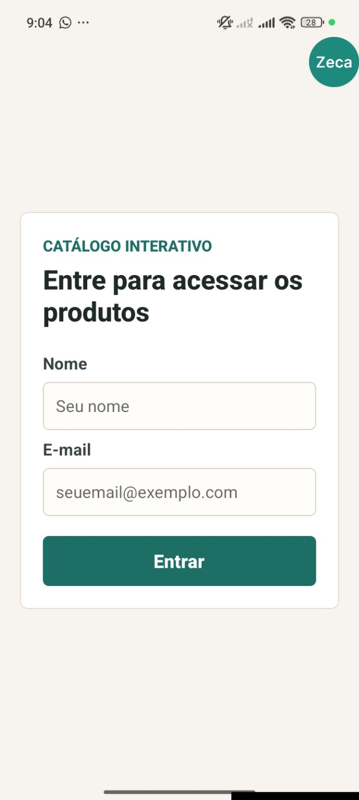
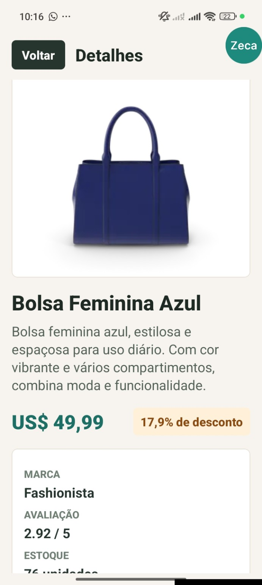

# Catálogo Interativo Mobile

Aplicativo mobile desenvolvido em React Native com Expo SDK 54 para apresentar produtos de uma loja online por categoria. Os dados dos produtos são obtidos da API REST DummyJSON, consumidos com Axios, e a interface do aplicativo está apresentada em português do Brasil. O projeto utiliza Redux Toolkit para armazenar temporariamente os dados do usuário logado e React Navigation para controlar o fluxo entre as telas.

## Funcionalidades

- Tela de login com validação de nome e e-mail.
- Armazenamento temporário do usuário com Redux Toolkit.
- Listagem de produtos por categorias masculinas e femininas.
- Navegação por abas entre Masculino e Feminino.
- Filtros por categorias exigidas no enunciado.
- Consumo da rota `/products/category/{categoria}` com Axios.
- Tela de detalhes do produto carregada pelo ID usando a rota `/products/{id}`.
- Exibição de nome, imagem, descrição, preço, desconto, avaliação e estoque.
- Botão Voltar na tela de detalhes usando React Navigation.
- Logout funcional, limpando o usuário armazenado e retornando à tela de login.
- Estados de carregamento e tratamento de erro nas requisições.

## Tecnologias Utilizadas

- React Native
- Expo SDK 54
- Axios
- Redux Toolkit
- React Redux
- React Navigation
- API DummyJSON

## Estrutura de Pastas

```text
mobile-development/
  App.js
  app.json
  index.js
  package.json
  README.md
  docs/
    prints/
      login.jpg
      produtos.jpg
      detalhes.jpg
  src/
    components/
      CategoryTabs.js
      ErrorState.js
      LoadingState.js
      ProductCard.js
    data/
      categories.js
      productPresentation.js
    screens/
      LoginScreen.js
      ProductDetailScreen.js
      ProductListScreen.js
    services/
      api.js
    store/
      authSlice.js
      store.js
```

## Instalação e Execução

1. Acesse a pasta do projeto:

```bash
cd "mobile development/mobile-development"
```

2. Instale as dependências:

```bash
npm install
```

3. Inicie o projeto com Expo:

```bash
npx expo start
```

4. Abra pelo Expo Go:

- Instale o aplicativo Expo Go no celular.
- Mantenha o celular e o computador na mesma rede Wi-Fi.
- Após executar `npx expo start`, escaneie o QR Code exibido no terminal ou na página do Expo.
- O aplicativo será aberto no celular pelo Expo Go.

Também é possível executar em um emulador Android ou iOS, se o ambiente estiver configurado.

## API Utilizada

Base da API:

```text
https://dummyjson.com
```

Rotas usadas no projeto:

```text
GET /products/category/{categoria}
GET /products/{id}
```

Os produtos são carregados diretamente da DummyJSON. A tradução dos nomes, descrições e textos visíveis acontece apenas na camada de apresentação do aplicativo.

## Categorias

Categorias masculinas:

- `mens-shirts`
- `mens-shoes`
- `mens-watches`

Categorias femininas:

- `womens-bags`
- `womens-dresses`
- `womens-jewellery`
- `womens-shoes`
- `womens-watches`

## Fluxo do Aplicativo

O usuário inicia na tela de login, informa nome e e-mail válidos e acessa a listagem de produtos. Na tela de produtos, ele pode alternar entre as abas Masculino e Feminino e selecionar categorias específicas. Ao tocar em um produto, o app navega para a tela de detalhes passando o ID do produto pela rota. A tela de detalhes busca os dados completos na API e exibe as informações principais em português do Brasil. Ao fazer logout, os dados do usuário são removidos do Redux e o app retorna para a tela de login.

Fluxo resumido:

```text
Login -> Produtos -> Detalhes -> Logout
```

## Prints das Telas

### Tela de Login



### Listagem de Produtos


### Detalhes do Produto

